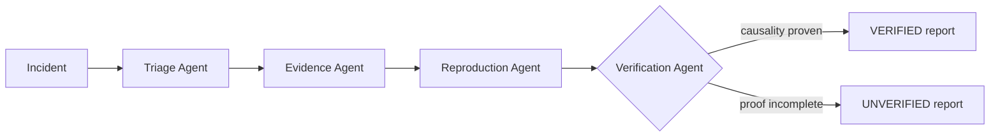

# TraceRoot

**From production failure to verified root cause.**


TraceRoot is an agentic production incident investigator built for the micro1 Frontier Engineering Challenge 2026. It treats diagnosis as an evidence and verification problem. Four bounded agents rank hypotheses, collect provenance, run controlled reproductions and challenge the result before a final report can claim a root cause.

> No root cause without evidence. If causality is not established, TraceRoot returns `UNVERIFIED`.

## Why this matters

Incident artifacts are fragmented across logs, stack traces, source, configuration, dependencies and Git history. General assistants can produce a plausible answer quickly, but plausibility is dangerous during an outage. TraceRoot builds a reviewable causal record: what was observed, what was executed, what contradicted each hypothesis and why the verifier accepted or rejected it.

## Product tour

The Next.js command center includes a dashboard, incident intake, live stage timeline, ranked hypothesis cards, provenance ledger, causal evidence graph, controlled reproduction terminal, independent verification panel, final report, evaluation comparison, knowledge base and trajectory viewer data.

The showcase route is `/investigations/demo-null`. It works without an API key.

## How TraceRoot works



- **Triage** ranks at most five hypotheses and identifies required evidence. It cannot declare the final cause.
- **Evidence** reads approved artifacts and records location, content hash, supporting and contradicting hypotheses.
- **Reproduction** can only invoke named commands through a directory-confined allowlist.
- **Verification** independently checks source, runtime and reproduction evidence and can reject the leading hypothesis.
- **Orchestrator** owns state, budgets, stage ordering and trajectory persistence. Agents do not recursively call each other.

See [Architecture](docs/ARCHITECTURE.md), [API](docs/API.md), [Reproduction](docs/REPRODUCTION.md) and the [improvement changelog](docs/IMPROVEMENT_CHANGELOG.md).

## Quick start

Requirements: Docker Desktop with Compose v2.

```bash
cp .env.example .env
# Replace SECRET_KEY in .env with a long random value.
docker compose up --build
```

- Frontend: <http://localhost:3000>
- API: <http://localhost:8000>
- Swagger UI: <http://localhost:8000/docs>
- ReDoc: <http://localhost:8000/redoc>
- Metrics: <http://localhost:8000/metrics>

The default `LLM_PROVIDER=demo` is deterministic and makes the full infrastructure explorable without paid keys. Set `LLM_PROVIDER=openai` or `groq`, the matching API key and `LLM_MODEL` for provider-backed triage.

## Evaluation

```bash
make eval
```

The committed evaluation artifacts were generated by executing all ten synthetic cases in deterministic offline demo mode:

| Metric                              | Single-pass baseline | TraceRoot |
| ----------------------------------- | -------------------: | --------: |
| Raw root-cause accuracy             |                  90% |      100% |
| Verified Root Cause Accuracy (VRCA) |                   0% |      100% |
| Evidence precision                  |                   0% |      100% |
| Reproduction success                |                   0% |      100% |
| False-confident diagnosis rate      |                  10% |        0% |

These values validate the deterministic orchestration, evidence, reproduction and scoring paths. They are **not represented as provider-backed LLM quality results**. See [case-level JSON](results/traceroot.json) and [comparison](results/comparison.md). The baseline receives the same incident, logs and source context but has no reproduction or verification gate; it is not intentionally degraded.

## Observable trajectories

TraceRoot stores instruction identifiers, summarized decisions, structured inputs/outputs, tool arguments and responses, retries, token usage, timings and verification feedback. It never stores hidden chain-of-thought. Representative artifacts:

- [Case 01](trajectories/case_01.json)
- [Case 05](trajectories/case_05.json)
- [Case 10](trajectories/case_10.json)

## Security

- Argon2 password hashing and short-lived JWT access tokens
- per-user workspace authorization on incidents, investigations and knowledge
- environment-only provider credentials
- CORS allowlist and Pydantic size limits
- path traversal and symlink escape prevention
- fixed command allowlist; no raw LLM-generated shell
- read-only evaluation mount and `no-new-privileges` in Docker
- human approval required before any production change

See [controlled tools ADR](docs/adr/004-controlled-tools.md). No deployment action is implemented by design.

## Development and quality gates

```bash
make setup
make lint
make test
make eval
make docker-build
```

Validated locally on Python 3.12 and Node 24:

- backend: Ruff clean, formatting clean, mypy strict clean, 15 tests passing, 88% statement coverage
- frontend: ESLint clean, TypeScript strict clean, 2 component tests passing, Next.js production build passing
- security: `npm audit --omit=dev` reports 0 vulnerabilities
- database: Alembic revision `0001` reaches head
- backend Docker image builds successfully

## Repository map

```text
backend/             FastAPI, SQLAlchemy, agents, orchestration, tools, evaluation
frontend/            Next.js command center
evaluation_cases/    ten reproducible synthetic incident repositories
baseline/            reasonable single-pass baseline
evals/               deterministic evaluator and report generation
results/             generated case-level measurements
trajectories/        representative observable execution traces
docs/                architecture, ADRs, API, reproduction and submission material
```

## Known limitations

- Provider-backed evaluation was not run because no OpenAI or Groq key was available; offline numbers are labeled accordingly.
- Investigations currently run in-request. A production deployment should move long provider runs to a durable worker while preserving the same state machine.
- JWT logout is client-side with short-lived access tokens; high-security deployments should add refresh-token rotation and revocation storage.
- The lightweight knowledge retriever uses lexical chunks, not semantic embeddings.
- The frontend test suite validates key components; browser-level Playwright automation remains a next hardening step.

## Hot take

For incident investigation, better reasoning matters less than forcing the agent to prove itself. The offline experiment supports the narrower claim that adding the evidence/reproduction/verification requirements changes what counts as correct: the baseline was often plausible, but its unsupported claims earned zero VRCA. Provider-backed experiments are still required before generalizing about LLM reasoning quality.

## Hackathon artifacts

- [Submission text](SUBMISSION.md)
- [5-minute video script](docs/VIDEO_SCRIPT.md)
- [Final audit](FINAL_AUDIT.md)
- [Improvement changelog](docs/IMPROVEMENT_CHANGELOG.md)

## License

[MIT](LICENSE)
