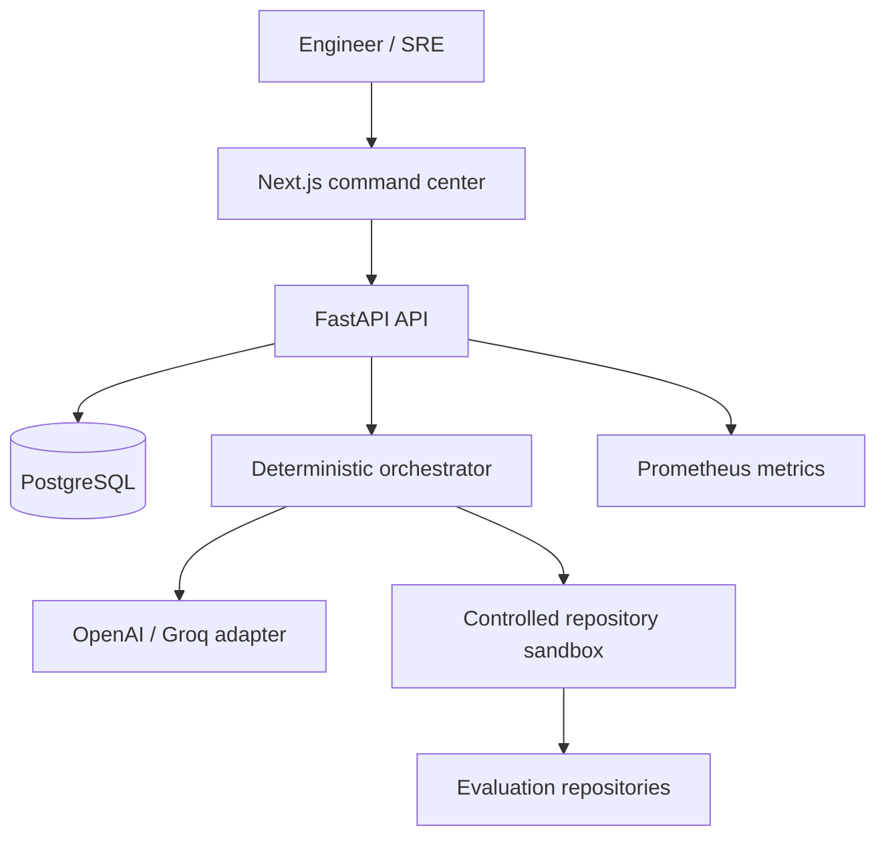
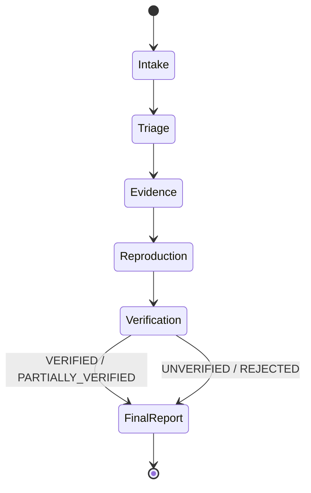
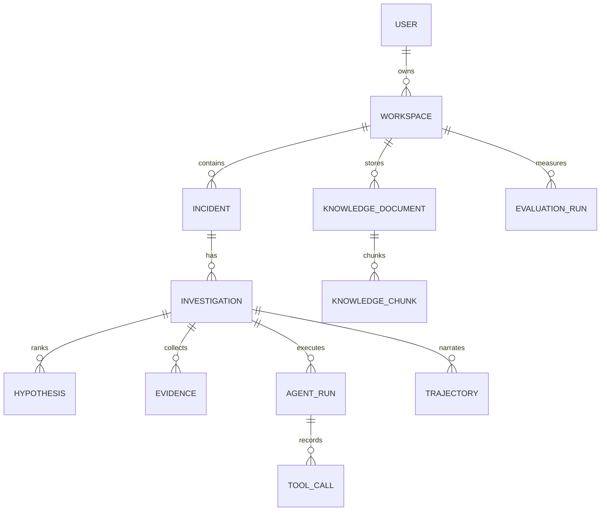
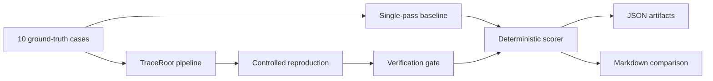

# Architecture

## System context

The frontend is a view and control plane. FastAPI owns authentication, authorization and domain state. The orchestrator, rather than the LLM, owns stage transitions. PostgreSQL is the production store; SQLite remains the zero-friction local/test option.

## Agent workflow

Each stage emits a typed Pydantic object. Iterations and tool calls are configuration-bounded. The verification gate is deliberately independent: a high triage confidence does not override missing evidence.

## Data model

UUID strings avoid database-specific UUID coupling in demo mode. JSON columns preserve typed agent output while first-class tables support authorization and querying.

## Evaluation workflow

Ground truth is used by the deterministic evaluator to score outputs. In offline demo mode, curated signatures make the pipeline reproducible and are explicitly not presented as an LLM benchmark.

## Reliability and observability

Every request receives an `x-request-id`. JSON logs support `request_id`, `investigation_id`, `agent`, `tool`, `duration_ms` and `status`. `/metrics` exposes HTTP counters and latency histograms. Agent runs store duration, tokens and approximate cost even when those values are zero in offline mode.

## Tradeoffs

- Explicit orchestration is smaller and easier to audit than adding LangGraph for a linear bounded workflow.
- In-request execution keeps the demo reproducible; a durable queue is the first scale-out change.
- Lexical chunks keep the knowledge base dependency-free. An embedding interface can replace ranking without changing persistence.
- The sandbox intentionally sacrifices arbitrary flexibility for a small, auditable command vocabulary.
